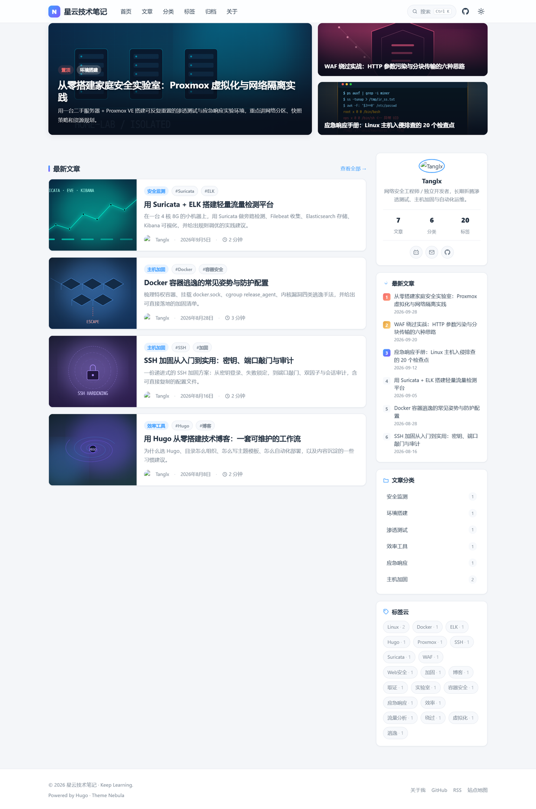
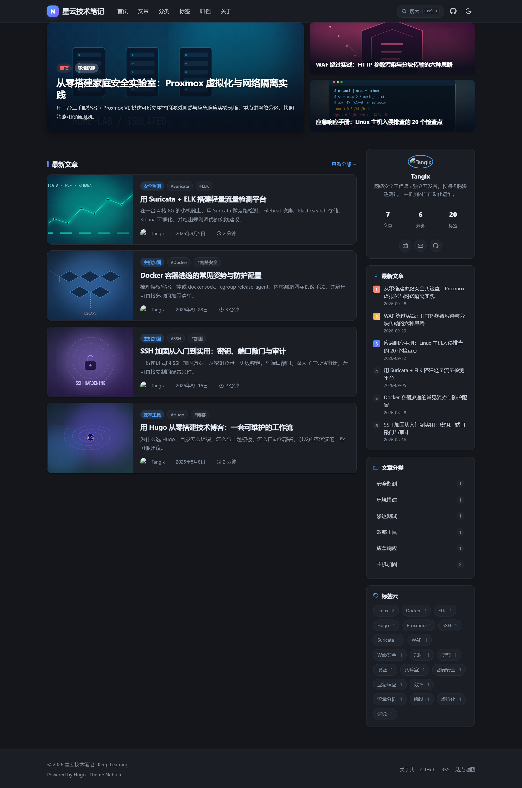
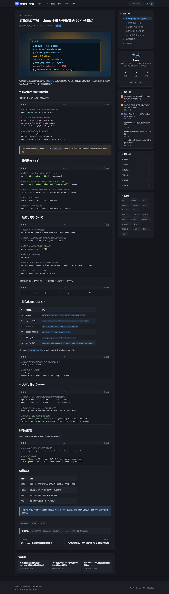
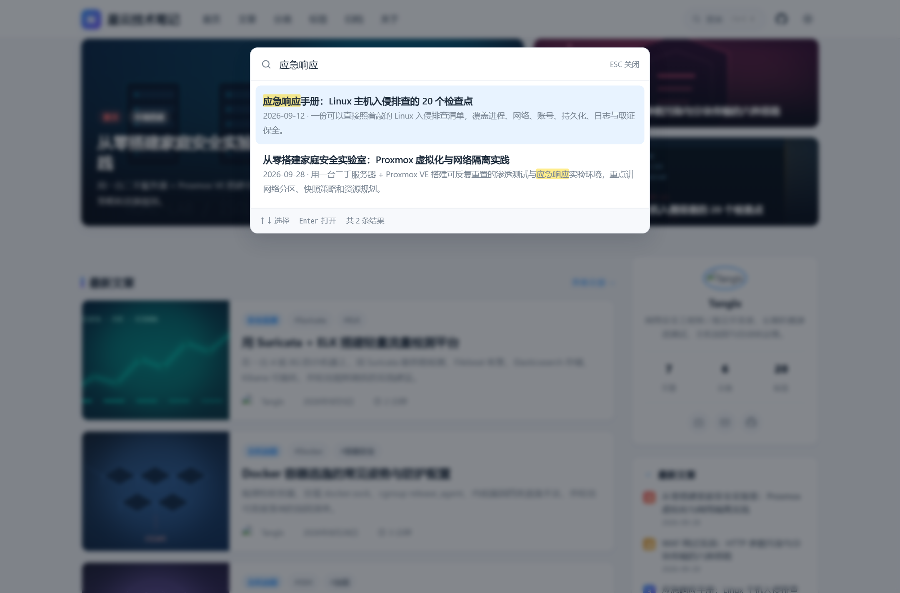
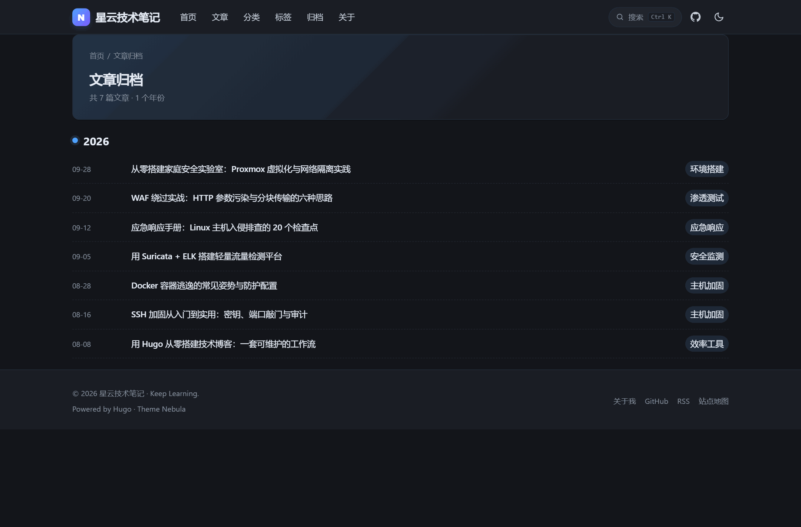

# Nebula — 一款清爽现代的 Hugo 博客主题

[](https://github.com/tanglx02/hugo-theme-nebula/actions/workflows/ci.yml)
[](https://gohugo.io/)
[](LICENSE)

面向技术博客的 Hugo 主题：**卡片流首页 + 焦点图、完整全文搜索、暗色模式、文章目录、图片 Pipeline、系列文章、代码高亮与一键复制**。零运行时依赖；默认配置下无外部 CDN 请求（启用可选评论/统计功能后会加载对应第三方服务资源，见下方说明）。

| 亮色 | 暗色 |
| --- | --- |
|  |  |

| 文章页（含目录） | 全站搜索 |
| --- | --- |
|  |  |

| 归档页 | 移动端 |
| --- | --- |
|  |  |

## 特性

- 🎴 **焦点图 + 卡片流首页**：置顶文章自动进入焦点区
- 🔍 **完整全文搜索**：正文任意位置（含数万字长文末尾）均可检索；`Ctrl+K` / `/` 呼出；支持 `?q=` 深链
- 🧩 **自动索引模式**：`mode = "auto"` 按索引体积自动决定单文件或分片，无需用户判断
- 🌗 **暗色模式**：跟随系统 + 手动切换 + 记忆
- 📑 **文章目录**：自动生成、滚动高亮
- 🖼️ **图片 Pipeline**：page bundle 图片自动生成 WebP 多尺寸 `srcset`，带 `width/height` 防 CLS；static 路径保持原样
- 📚 **系列文章**：`series` + `series_order`，显示进度与系列内上下篇
- 💻 **代码块**：macOS 风格窗口、语言标签、`filename` / 行号 / 指定行高亮、一键复制
- 💡 **Markdown 提示块**：GitHub / Obsidian 风格的 `> [!NOTE]` 五种语义类型（Note/Tip/Important/Warning/Caution），
  纯 Render Hook + CSS、**零 JavaScript**；默认标题走 i18n，可自定义标题；未知类型自动退化为普通引用（**不会让构建失败**）；
  非提示块的普通引用与历史输出**逐字节相同**
- 🖼️ **灯箱**：`role=dialog` + Focus Trap（Tab 循环、背景 inert、Esc 关闭、焦点归还）
- 🌍 **i18n**：内置 `zh-CN` / `zh-TW` / `en`
- 🔀 **多 Section**：内容范围通过 `params.content.sections` 配置，不写死 `posts`
- 🔗 **分享**：可选开关（复制链接 / X / Telegram / Facebook / Reddit / 微博 / 微信），
  复制失败会明确提示"复制失败，请手动复制"，**绝不把超时/被拒伪装成成功**
- 📡 **RSS 增强**：标题 / 描述 / 作者 / 分类 / pubDate / updated，支持 `fullContent` 全文输出
- 🔎 **SEO**：canonical、OG、Twitter Card、BlogPosting + WebSite JSON-LD、SearchAction、hreflang、sitemap、robots
- ♿ **无障碍**：键盘可达、焦点可见、`prefers-reduced-motion`、触屏点击区 ≥ 24px
- 🛡️ **发布门禁**：Release 全站审计以构建产物 HTML inventory 为真值；sitemap 作为独立 SEO 索引质量检查；分页 crawler 用于交叉验证额外分页，不再作为全站真值。
  （覆盖别名页与 404 等 sitemap 之外的页面）
  三浏览器 × 四视口；i18n 硬编码静态扫描防回归；测试脚本失败一律 `exit 1`
- ⚡ **默认零依赖**：无 jQuery / 无外部字体 / 默认无外部 CDN 请求；
  启用可选的评论或统计功能后，页面会加载对应第三方服务的资源（见下方"第三方服务说明"）

## 环境要求

- **Hugo extended** ≥ 0.128（extended 版本必需：图片 WebP 处理与 SCSS 需要）

### 版本兼容（CI 实测）

最低版本不是估计值：CI 用多个真实 Hugo 版本对 `exampleSite` 做生产构建。

| Hugo 版本 | 默认配置（auto） | 显式 `mode = "shard"` |
| --- | --- | --- |
| 0.128.0 | ✅ 通过 | ❌ 明确报错（不支持） |
| 0.148.0 | ✅ 通过 | ❌ 明确报错（不支持） |
| 0.162.0 | ✅ 通过 | ❌ 明确报错（不支持） |
| 0.166.0 | ✅ 通过 | ✅ 通过 |
| 0.167.0 | ✅ 通过 | ✅ 通过 |
| latest | ✅ 通过 | ✅ 通过 |

> **默认 `auto` 模式的兼容行为（重要）**
> `auto` 会按正文总体积在 single / shard 之间自动选择。分片依赖 `resources.Publish`，
> 该 API 从 **Hugo 0.166.0** 起提供。因此在 0.128–0.162 上：
> - **默认 `auto`**：超过 `autoThreshold` 时**自动回退为单文件索引**（打一条 WARN），
>   构建照常成功，**全文搜索能力不变**（单文件同样收录完整正文）；
> - **显式 `mode = "shard"`**：仍然**明确报错**并给出升级 / 改用 single 的提示
>   ——不静默降级，避免你以为已启用分片。
>
> 也就是说：**默认配置在声明的最低版本 0.128.0 上始终能构建**（v1.0.9 之前
> 这里会直接构建失败，是独立测试发现的 P1 缺陷）。若你希望在大体量站点上真正启用
> 分片，请使用 Hugo ≥ 0.166.0。

## 快速开始

```bash
hugo new site myblog && cd myblog
git init
git submodule add https://github.com/tanglx02/hugo-theme-nebula.git themes/hugo-theme-nebula
```

最小配置（`hugo.toml`）：

```toml
baseURL = 'https://your-domain.com/'
locale = 'zh-CN'
title = '我的博客'
theme = 'hugo-theme-nebula'
hasCJKLanguage = true

[pagination]
  pagerSize = 8                   # 每页文章数（Hugo ≥ 0.128 用此项，旧的 paginate 已失效）

[outputs]
  home = ['HTML', 'RSS', 'JSON']  # JSON 用于生成搜索索引，必须保留

[markup]
  [markup.highlight]
    noClasses = false             # false = 使用 CSS class，代码配色可随暗色模式切换
  [markup.goldmark]
    [markup.goldmark.renderer]
      unsafe = false              # 主题不依赖 raw HTML；仅当你的文章需要原始 HTML 时才设为 true

[params]
  author = '你的名字'
  description = '博客描述'
```

> ⚠️ **漏配 `outputs` 的后果（DOC-02）**：Hugo **不会**把主题自带的配置合并进你的站点配置。
> 如果你的站点配置里没有写上面那段 `[outputs]`，`home` 就只输出 HTML，**不会生成 `index.json`**，
> 搜索会表现为"加载失败"（界面上有明确报错与重试按钮，不会白屏）。
> 排查方式：构建后检查站点根目录是否存在 `index.json`。

写文章并预览：

```bash
hugo new content posts/hello-world.md
hugo server -D      # 打开 http://localhost:1313
```

> 生产构建请用 `hugo --gc --minify`，**不要**把 `hugo server` 的输出当作生产产物（它会注入 livereload）。

## 完整配置参考

```toml
[params]
  author = 'Tanglx'
  subtitle = '记录安全与运维的每一次实践'
  description = '站点 SEO 描述'
  avatar = 'img/avatar.svg'              # 放站点 static/ 下
  logoText = 'N'                         # 无 logo 图时导航栏显示的字母
  homePostCount = 8                      # 首页"最新文章"数量
  footerText = 'Keep Learning.'
  license = '本文采用 CC BY-NC-SA 4.0 许可，转载请注明来源。'

  [params.profile]
    bio = '侧边栏个人名片简介'

  [params.socials]                       # 留空即不显示对应图标
    github = 'https://github.com/yourname'
    email = 'mailto:you@example.com'
    bilibili = 'https://space.bilibili.com/xxx'

  [params.sidebar]
    hotCount = 6

  # ---------- 内容范围（不再写死 posts） ----------
  [params.content]
    sections = ["posts"]                 # 可多个：["posts", "tutorials", "notes"]

  # ---------- 搜索 ----------
  [params.search]
    enable = true
    mode = "auto"                        # auto（默认）| single | shard
    autoThreshold = 512000               # auto 模式的阈值（正文总字节数，约 500KB）
    contentLimit = 0                     # 单篇正文索引上限（0 = 不限制，保证全文可搜）
    shard = false                        # 兼容旧配置：true 等价于 mode = "shard"

  # ---------- 图片 Pipeline ----------
  [params.images]
    widths = [480, 768, 1200]            # 生成的宽度档位
    sizes = "(max-width: 768px) 100vw, 900px"
    quality = 85
    format = "webp"

  # ---------- RSS ----------
  [params.rss]
    fullContent = false                  # true = 输出全文（content:encoded），false = 仅摘要
    limit = 20

  # ---------- 分享（默认关闭） ----------
  [params.share]
    enable = false
    providers = ["copy", "x", "telegram", "facebook"]   # 可选 reddit / weibo / wechat

  # ---------- 评论（默认关闭） ----------
  [params.comments]
    enable = false
    provider = 'giscus'                  # giscus | waline | twikoo | disqus
    [params.comments.giscus]
      repo = 'yourname/yourrepo'
      repoID = 'R_xxxxxxx'
      category = 'Announcements'
      categoryID = 'DIC_xxxxxxx'

  [params.views]
    enable = false
  [params.busuanzi]
    enable = false
```

### 第三方服务说明（可选功能）

主题**默认配置下不加载任何第三方资源**（已由 CI 断言）。以下功能一旦启用，
页面会加载对应第三方服务的脚本/样式，其可用性与隐私政策由服务方决定：

| 功能 | 服务 | 加载的资源 | 备注 |
| --- | --- | --- | --- |
| 评论（giscus） | giscus.app | `https://giscus.app/client.js` 及其 iframe | locale 跟随站点语言，可用 `comments.giscus.lang` 覆盖 |
| 评论（Waline） | Waline + unpkg | `unpkg.com` 上的 CSS/JS + 你自建的 `serverURL` | locale 跟随站点语言，可用 `comments.waline.lang` 覆盖 |
| 评论（Twikoo） | Twikoo + jsDelivr | `cdn.jsdelivr.net` 上的 JS + 你自建的 `envId` | locale 跟随站点语言，可用 `comments.twikoo.lang` 覆盖 |
| 评论（Disqus） | disqus.com | `https://<shortname>.disqus.com/embed.js` 及其 iframe | Disqus 无 locale 参数，语言在其后台配置 |
| 访问统计（busuanzi） | busuanzi.ibruce.info | 不蒜子统计脚本 | 仅 `params.busuanzi.enable = true` 时加载 |
| 浏览量（views） | 你自己的统计后端 | 取决于 `params.views` 配置 | 默认关闭 |

评论组件语言映射：站点语言 `zh` / `zh-cn` / `zh-hans` → `zh-CN`；
`zh-tw` / `zh-hant` / `zh-hk` → `zh-TW`；`en` / `en-us` / `en-gb` → `en`。
未命中映射的语言会原样传给第三方组件，不会强造不存在的 locale。

#### 供应链与 CSP 建议（SEC-02）

以上第三方脚本**默认全部关闭**；一旦启用，脚本来自第三方 CDN，属于供应链风险面。
本主题提供两项可选强化：

1. **子资源完整性（SRI）**：可为你选择的版本提供 `integrity` 值，主题会连同
   `crossorigin="anonymous"` 一起输出：

   ```toml
   [params.busuanzi]
     enable = true
     integrity = 'sha384-……'      # 取自你锁定的脚本版本

   [params.comments.giscus]
     integrity = 'sha384-……'

   [params.comments.twikoo]
     integrity = 'sha384-……'
   ```

   > 主题**不预置** integrity 值：这需要锁定具体版本并逐版本更新，硬编码过期哈希
   > 会让脚本直接加载失败。Waline（ESM `import`）与 Disqus（运行时拼 `src`）
   > 无法用 `<script integrity>` 覆盖，建议自托管或在上游加代理。

2. **CSP**：主题不写死 CSP（不同站点启用/禁用的服务不同）。推荐在托管方以
   **响应头**下发，示例（按需删减）：

   ```text
   Content-Security-Policy:
     default-src 'self';
     script-src  'self' https://giscus.app https://cdn.jsdelivr.net https://busuanzi.ibruce.info;
     style-src   'self' https://unpkg.com;
     frame-src   https://giscus.app;
     img-src     'self' data: https:;
   ```

   > 注意：主题在 `<head>` 有一段防主题闪烁（FOUC）的内联脚本、以及注入 i18n
   > 文案的内联脚本，因此 `script-src` 需要 `'unsafe-inline'` 或以 nonce/hash 放行，
   > 否则主题切换与搜索会失效。

不蒜子统计使用 **`https://` 绝对地址**（而非协议相对 `//host/...`），
避免在 HTTP 环境下退化为明文加载。

### 多语言站点

主题完整支持 Hugo multilingual（`[languages]` 配置）：

- 页面 `<html lang>`、`og:locale`（含 `og:locale:alternate`）、`hreflang` 自动输出；
- UI 文案内置 zh-CN / zh-TW / en 三语言，评论组件 locale 跟随站点语言；
- 分类、标签、Series、搜索索引、RSS 均按语言隔离。

主题**没有语言切换按钮**——语言切换通过 URL 结构与 `<link rel="alternate" hreflang>` 完成
（如 zh-CN 在根路径、en 在 `/en/` 子路径），这是有意为之的轻量设计。

### 导航菜单

```toml
[[menu.main]]
  name = '首页'
  url = '/'
  weight = 1
[[menu.main]]
  name = '归档'
  url = '/archives/'
  weight = 5
[[menu.main]]
  name = 'GitHub'
  url = 'https://github.com/yourname'
  weight = 6
  [menu.main.params]
    external = true        # 新标签页打开
```

归档页需要 `content/archives/_index.md`：

```yaml
---
title: "文章归档"
layout: "archive"
---
```

## 全文搜索与索引模式

索引由 `layouts/_default/index.json` 在构建期生成，包含每篇文章的**完整正文纯文本**（仅压缩连续空白），因此正文任意位置都能被检索。

三种模式：

| 模式 | 行为 | 适用 |
| --- | --- | --- |
| `single` | 单个 `index.json` 包含全部正文 | 小型站点，最简单 |
| `shard` | 主索引只含元数据，正文按**体积分块**（chunk）到 `search/chunk-N.json`，前端并发加载 | 中大型站点 |
| `auto`（默认） | 按正文总体积自动在 single / shard 之间选择（阈值 `autoThreshold`） | 推荐 |

```toml
[params.search]
  enable = true
  mode = "auto"          # auto | single | shard（兼容旧的 shard = true）
  autoThreshold = 512000 # auto 模式阈值（字节）
  chunkSize = 204800     # 分片模式下每个 chunk 的目标体积（字符数）
  contentLimit = 0       # 单篇正文上限，0 = 不限制
```

实测数据（每篇约 3000 字，Chromium，本地静态服务器）：

| 文章数 | 模式 | 主索引 | chunk 数 | 索引加载 | 搜索等待 | JS 堆 |
| --- | --- | --- | --- | --- | --- | --- |
| 500 | single | 4.4 MB | – | 532 ms | 647 ms | 6.1 MB |
| 500 | auto→shard | 84 KB | 22 | 163 ms | 248 ms | 5.9 MB |
| 1000 | single | 8.8 MB | – | 1283 ms | 1322 ms | 8.6 MB |
| 1000 | auto→shard | 168 KB | 44 | 331 ms | 379 ms | 8.8 MB |
| 2000 | single | 17.6 MB | – | 3988 ms | 3989 ms | 23.5 MB |
| 2000 | auto→shard | 338 KB | 87 | 1344 ms | 1347 ms | 25.7 MB |

> 分片按**体积**合并（而不是每篇一个文件）：请求数与正文总量成正比，而不是与文章数成正比。
> 2000 篇时若按文章分片会产生 2000 个请求，实测搜索延迟明显劣化。

搜索索引加载失败时会有明确提示：主索引失败显示错误并可**重试**；部分分片失败时提示"部分索引加载失败（N 篇未能加载）"且仍返回其他文章的结果（**不会误报"没有找到"**）。

## 图片处理

两种图片写法，行为不同：

1. **page bundle 资源**（推荐）：把图片与 `index.md` 放在同一目录，正文写 ``
   → 自动生成 WebP 多尺寸 `srcset`、`sizes`、`width/height`（防 CLS）、`loading="lazy"`，并保留原图供灯箱放大。
2. **static 路径或外链**：``、`https://…`
   → 与旧版完全一致，不做处理（**已有站点的资源写法不受影响**）。

SVG 等不可处理的资源会按原样输出。缺失图片不会导致构建失败。

## 系列文章（Series）

```yaml
---
title: "Hugo 建站系列：主题与样式"
series: ["Hugo 建站系列"]
series_order: 2          # 可选；缺省时按日期排序
---
```

文章页会显示系列名、进度（第 N 篇 / 共 M 篇）、系列全部文章列表、系列内上一篇/下一篇。**未配置 `series` 时完全不输出**，不影响原有的上一篇/下一篇导航。

## 多语言（i18n）

主题内置 `i18n/zh-CN.yaml`、`zh-TW.yaml`、`en.yaml`。**模板与 JS 中的 UI 文案全部来自 i18n**，
JS 侧通过 `window.NEBULA_I18N` 注入（脚本内不硬编码文案，仅有英文兜底以防注入失败）。

单语言站点无需配置；多语言站点示例（**注意 Hugo ≥ 0.158 用 `locale` 决定翻译包，仅改
`defaultContentLanguage` 不够**）：

```toml
defaultContentLanguage = 'zh-CN'
locale = 'zh-CN'

[languages]
  [languages.zh-CN]
    label = '简体中文'
    weight = 1
    [languages.zh-CN.params]
      description = '中文站点描述'
  [languages.en]
    label = 'English'
    weight = 2
```

多语言站点会自动输出 `hreflang` 标签。

### 导航菜单跟随语言

给菜单项加 `identifier`，主题会查找 `menu.<identifier>` 词条（缺失时回退到 `name`，因此
旧配置完全兼容）：

```toml
[[menu.main]]
  identifier = 'posts'    # → i18n 词条 menu.posts
  name = '文章'            # 回退值
  url = '/posts/'
  weight = 2
```

内置 identifier：`home` `posts` `categories` `tags` `archives` `about` `aboutMe`；
自定义 identifier 只需在 `i18n/<lang>.yaml` 里补一个 `menu.<identifier>` 词条。

## Front Matter 字段

```yaml
---
title: "文章标题"
date: 2026-10-08
lastmod: 2026-10-08
draft: false
description: "摘要：用于列表卡片、搜索片段与 SEO"
author: ""                # 留空使用站点 author
tags: ["Hugo"]
categories: ["效率工具"]
series: ["Hugo 建站系列"] # 可选
series_order: 1           # 可选
cover: "/img/cover/x.png" # 封面；无则用渐变占位
sticky: false             # true = 置顶并进入首页焦点区

# ---- 显示控制（全部可选，默认值与历史视觉一致）----
toc: true                 # 目录
comments: true            # 评论
showDate: true            # 日期
showLastmod: false        # 更新日期
showReadingTime: true     # 阅读时长
showWordCount: true       # 字数
showTags: true            # 标签
showRelated: true         # 相关文章
showNav: true             # 上下篇导航
showSeries: true          # 系列卡片
showShare: false          # 分享（也可用 params.share.enable 全局开启）
lightbox: true            # 图片灯箱
breadcrumb: true          # 面包屑（可选）
showProgress: true        # 阅读进度条（可选，默认取 params.reading.progressBar）
showBackToTop: true       # 返回顶部（可选，默认取 params.reading.backToTop）
showFocusMode: false      # 专注模式入口（可选，默认取 params.reading.focusMode）
---
```

## 分享

默认关闭。开启后为纯链接按钮（不加载任何第三方脚本）：

```toml
[params.share]
  enable = true
  providers = ["copy", "x", "telegram", "facebook", "weibo", "wechat"]
```

## Markdown 提示块（Callouts）

写法与 GitHub / Obsidian 的 alert 语法一致，**纯 Render Hook + CSS、零 JavaScript、零第三方请求**：

```markdown
> [!NOTE]
> 有用的补充信息。

> [!TIP]
> 更推荐的做法。

> [!IMPORTANT]
> 必须知道的关键信息。

> [!WARNING]
> 可能造成问题的内容。

> [!CAUTION]
> 存在风险，行动前请确认。

> [!WARNING] 自定义标题
> 类型标记后跟文字即可替换默认标题（类型与图标不变）。
```

| 类型 | 简体中文 | 繁體中文 | English |
| --- | --- | --- | --- |
| `NOTE` | 说明 | 說明 | Note |
| `TIP` | 提示 | 提示 | Tip |
| `IMPORTANT` | 重要 | 重要 | Important |
| `WARNING` | 警告 | 警告 | Warning |
| `CAUTION` | 注意 | 注意 | Caution |

行为约定（均有测试断言，见 `tools/check_content_components.py`）：

- **默认外观不变**：没有类型标记的普通引用与开启本功能前**逐字节相同**（全站产物 diff = 0）；
- **未知类型不报错**：`> [!BOGUS]` 之类不在上表内的类型**退化为普通引用**，绝不生成错误的提示块，
  也不会让构建失败（Hugo 会把任意 `> [!XXX]` 都放进 `.AlertType`，主题自行守卫）；
- **零 JS / 零外部依赖**：图标是内联 SVG，配色复用主题设计变量，暗色模式自动适配；
- **版本兼容**：blockquote 渲染钩子自 **Hugo 0.148.0** 起生效；在 **0.128.0** 上该文件被 Hugo
  静默忽略，提示块退化为普通引用（`[!NOTE]` 标记行原样显示），**构建不报错**，因此最低版本仍为 0.128.0。

演示页：`exampleSite/content/posts/alerts-and-callouts.md`（英文：`content-en/posts/alerts-and-callouts.md`）。

## 代码块

````markdown
```js {filename="app.js"}
console.log(1)
```

```python {filename="utils.py" linenos=true hl_lines="2-3"}
import os
print(1)
print(2)
```
````

支持 `filename`（显示文件名）、`linenos`（行号）、`hl_lines`（高亮行）、未知语言与无语言代码块（安全降级为纯文本）。

## exampleSite / 本地开发

```bash
git clone https://github.com/tanglx02/hugo-theme-nebula.git
cd hugo-theme-nebula

# 生成压力测试数据（可选，用于跑完整测试）
python3 tools/gen_testdata.py --posts-dir exampleSite/content/posts

# 预览示例站点
hugo server --source exampleSite --themesDir ../..

# 生产构建
hugo --source exampleSite --themesDir ../.. --gc --minify -d ../public
```

## 测试与 CI

### 退出码约定（这是 CI 门禁可信的前提）

`tools/` 下所有测试脚本共用 `tools/_testlib.py`：

| 情况 | 退出码 |
| --- | --- |
| 产品问题 / 断言失败 | 1 |
| 测试脚本自身异常 | 1 |
| 依赖缺失（playwright / pillow） | 1 |
| 浏览器无法启动 | 1 |
| 被测站点 / 静态服务器不可达 | 1 |
| 一个用例都没执行到 | 1 |
| 全部通过 | 0 |

最后一个输出行是机器可读结果，便于 CI 与报告解析：

```
TEST-RESULT: {"suite": "audit", "status": "PASS", "passed": 7, "failed": 0, "total": 7}
```

> 没有这条约定的"打印 FAIL 但进程仍 exit 0"会让 CI 变成假绿灯 —— CI 是否可信，
> 唯一标准是**失败时进程 exit≠0 且 GitHub Actions 真的变红**。

### CI Job

`.github/workflows/ci.yml` 在 GitHub Actions 上**真实运行**以下检查，任一失败即 CI 失败：

| Job | 内容 | 展开数量 |
| --- | --- | --- |
| Build (0.128 / 0.148 / 0.162 / 0.166 / 0.167 / latest) | 生成压力数据（含**边界夹具**与 page bundle 图片）→ 生产构建 → **边界产物与图片管线断言** → 产物校验 → 索引完整性 → **搜索模式与 auto 阈值边界** → 草稿/未来排除 → livereload 检查 | 6 |
| Sub-directory baseURL | `/blog/` 构建 + 断言无越界路径、无 basePath 重复 | 1 |
| Static checks | 死链、索引完整性（含分片 chunk 正文）、功能断言、i18n 静态硬编码扫描、i18n 三语言构建与文案校验、多 Section 回归、**搜索日期三语言契约**、**文章页判定与 pagination.path 兼容**、**alias 页结构检查**、**CI job inventory（含结构契约）**、**workflow 策略（权限/runner/Node24/SHA）**、**内容组件（提示块 5 类型/i18n/未知类型/普通引用逐字节等价/Hugo 0.128–0.167 矩阵/alias 空值回归）** | 1 |
| Browser tests (chromium / firefox / webkit) | 响应式审计（320–1440）、交互回归、复制语义专项、灯箱 Focus Trap、搜索边界与竞态、**搜索高亮特殊字符安全**、**搜索结果日期本地化（zh-CN / en）**、**弹窗滚动锁定（三引擎）**、**对比度 AA（浅/深）**、**边界宽度横向溢出（含英文站）**、分片失败深层关键词语义、三种 baseURL 部署 | 3 |
| Release full-site audit (chromium / firefox / webkit) | 仅 tag（`v*`）或手动触发：`AUDIT_FULL=1` 以构建产物 HTML inventory 为真值，全量加载审计（320/375/768/1440），并交叉验证分页覆盖 | 3 |

**job 数量不手写**：`tools/check_ci_jobs.py` 按 GitHub matrix 展开规则算出每个 job 的
实际数量，再与 workflow 注释里登记的 `# CI-JOBS: <job>=<n>` 清单比对。改了 matrix
（加浏览器 / 加 Hugo 版本）而没更新清单，CI 会直接变红。

| 触发方式 | 预期 job 数 |
| --- | --- |
| tag 推送（`v*`）/ 手动触发 | **14**（含 3 个 Release） |
| 普通 push / PR | **11**（Release job 被 `if` 跳过） |

**Runner 与权限（有意固定）**

- 生产门禁 runner = **`ubuntu-24.04`**：GitHub 已宣布 `ubuntu-latest` 将于 2026-10-19
  起迁移 Ubuntu 26.04，长期基线不该在下一次平台迁移时悄悄改变底层 OS
- 最新镜像兼容性由独立 workflow `compat-latest.yml`（`ubuntu-latest`，每周 + 手动）提前暴露，
  **不计入生产门禁**
- 顶层 `permissions: contents: read`；任何 job 不允许 `*: write`；
  只需检出源码的 job 进一步设 `permissions: {}`
- Actions 统一使用 Node 24 兼容版本（checkout v7 / setup-python v7 / cache v6 /
  upload-artifact v7 / actions-hugo v3.2.1），由 `check_workflow_policy.py` 校验

> PR 阶段用抽样页面保证时长可控；Release 阶段用全量页面。

### 全站审计的覆盖保证

`AUDIT_FULL=1` 不只是"跑得多"，还会主动证明没有漏。三条独立证据链：

1. **数量一致**：构建产物 inventory（`public/**/*.html`）100% 被加载审计，
   硬断言 `EXPECTED == AUDITED`；审计了产物中不存在的 URL 同样判失败；
2. **分页交叉验证**：所有"可爬取的分页页"都必须能被 crawler 从列表页走到
   （`/page/1/` 这类**别名分页页**按设计不被任何页面链接，由 inventory 直接覆盖，
   单独计数说明）；
3. **alias 独立静态检查**：浏览器打开 alias 会被 meta-refresh 重定向到 canonical，
   看到的是**目标页**而不是 alias 本身，因此 alias 的结构由
   `tools/check_alias_pages.py` 单独验证（meta refresh / canonical / 目标存在 /
   无额外 JS / 资源完好 / lang 一致）。

其他硬断言：

- **类型齐全**：`分类 term / 标签 term / page/2/ / page/3/ / 分类首页 / 标签首页 / 归档页 / 文章页`
  任一类型缺失即失败；
- **crawl 种子齐全**：首页 / 内容 section 列表页 / 分类 term / 标签 term / 归档页都必须参与种子，
  且种子里**不能出现文章页**（否则 `/categories/foo/` 这类 term 页会被误剔除）；
- **白名单精确匹配**：故意缺失的测试资源按 **pathname 精确比对**豁免。
  绝不使用 `endswith` —— 否则 `/images/not-exist.png` 这类真实损坏资源会被误豁免成假绿灯。

> Hugo 的 sitemap 不包含 `/page/N/`，且页面可经 `sitemap.disable` 完全不进 sitemap，
> 所以 **sitemap 只能是独立 SEO 检查项，不是全站真值**。

### 复制行为的硬性约定

代码块复制、分享复制链接、微信复制共用同一实现，**结果只有成功 / 失败两种**：

| 场景 | 结果 |
| --- | --- |
| `navigator.clipboard.writeText` resolve | 成功 |
| `writeText` reject | 走 fallback |
| `writeText` 长时间 pending（>1200ms） | 走 fallback，**绝不显示成功** |
| 无 Clipboard API | 走 fallback |
| `document.execCommand('copy')` 返回非 `true` | **失败**（显示"复制失败，请手动复制"） |

`tools/verify_copy.py` 对以上每条路径都有断言（13 例），并对代码块按钮、
分享按钮、微信按钮分别验证。

### 本地运行

```bash
export HUGO_BIN=/path/to/hugo          # Linux/macOS 可省略（默认 hugo）
export PLAYWRIGHT_PROXY=http://127.0.0.1:port   # 本地有 HTTP 代理时才需要
python3 tools/serve.py public 8080 &   # 独立静态服务器（勿用 hugo server 产物测试）

python3 tools/link_check.py public                 # 死链（失败即 exit 1）
python3 tools/check_index.py public/index.json     # 索引完整性
python3 tools/check_features.py public             # 功能断言（26 项）
python3 tools/check_i18n_hardcode.py               # UI 文案是否被写死进模板/脚本
python3 tools/verify_i18n.py public zh-CN          # 渲染结果文案是否来自 i18n
SITE_DIR=exampleSite HUGO_ARGS='--source . --themesDir ../..' \
  python3 tools/verify_multisection.py             # 多 Section 完整回归
AUDIT_BROWSERS=chromium python3 tools/audit.py http://127.0.0.1:8080
AUDIT_FULL=1 AUDIT_BROWSERS=chromium AUDIT_VIEWPORTS=320,375,768,1440 \
  python3 tools/audit.py http://127.0.0.1:8080     # 等价于 Release 全站审计
python3 tools/verify_copy.py http://127.0.0.1:8080 chromium   # 复制语义（13 例）
PW_BROWSERS=chromium python3 tools/interactions.py http://127.0.0.1:8080
python3 tools/verify_lightbox.py http://127.0.0.1:8080 chromium
python3 tools/verify_search_edge.py http://127.0.0.1:8080
python3 tools/verify_search_shard.py http://127.0.0.1:8090 chromium
python3 tools/bench_index.py 500,1000,2000         # 索引规模压测（记录体积/请求数/耗时/内存）
```

> `check_i18n_hardcode.py` 会自动定位主题源码目录：命令行参数 > `NEBULA_THEME_DIR` >
> 仓库根 > 站点侧 `myblog/themes/hugo-theme-nebula`；全部候选都不合格时报错退出，
> 不会因为"扫不到文件"而静默通过。


## 更新日志

> 完整变更记录见 [CHANGELOG.md](CHANGELOG.md)。
> 修改主题前请先阅读 [docs/稳定基线.md](docs/稳定基线.md)（CI 真实执行的契约清单）。

### v1.0.9 — 最终封版（搜索日期 i18n / 分页判定 / CI 现代化）

**搜索结果日期本地化（最后一个真实 UI i18n 缺陷）**

- 索引新增 UI 字段 `dateDisplay`：由 Hugo **在构建期**按站点语言生成
  （zh-CN `2026年9月28日` / en `Sep 28, 2026` / zh-TW `2026年9月28日`）
- `date` 保留为机器字段 `YYYY-MM-DD` 供程序使用，前端不再直接显示它
- 缺日期的文章两个字段均为空串，UI 省略日期片段（不会显示 `0001-01-01`）
- 新增 `tools/check_search_date.py`（30 项：三语言 × 多文章 × 缺日期 × 向后兼容）

**pagination crawler 判定修正**

- 文章页判定改为基于 `params.content.sections`：`/categories/foo/`、`/tags/foo/`、
  `/archives/`、`/page/N/` 都不再被误判成文章页（旧规则 `/[^/]+/[^/]+/` 会误判）
- `pagination.path` **不再写死 `page`**：支持 Hugo `[pagination] path`（实测 "p" 与 "page"）
- 种子排除分页页本身 —— 此前分页页也在种子里，`discovered` 恒为 0，交叉验证形同虚设；
  现在实测"构建产物中 6 个可爬取分页页全部被爬虫发现"
- 新增 `tools/check_article_classification.py`（39 项）

**alias 页面独立静态检查**

- 新增 `tools/check_alias_pages.py`：meta refresh / canonical / 目标存在 / 无自引用 /
  无额外 JS / 资源完好 / lang 与站点一致 / title 非空
- 覆盖 `layouts/alias.html`，修正"站点页面 `lang=zh` 而 alias 页 `lang=zh-CN`"的不一致

**GitHub Actions 现代化**

- Actions 升级到 Node 24 兼容稳定版（checkout v7.0.1 / setup-python v7.0.0 /
  cache v6.1.0 / upload-artifact v7.0.2；actions-hugo v3.2.1 本身已是 node24）
- 生产门禁 runner 固定 `ubuntu-24.04`；`ubuntu-latest` 兼容性另建 `compat-latest.yml`
- 顶层 `permissions: contents: read`，无 write 权限，仅检出源码的 job 设 `permissions: {}`
- **CI job 数量不再手写**：`tools/check_ci_jobs.py` 按 matrix 展开计算（tag 14 / push 11）

**搜索高亮安全回归**

- 新增 `tools/verify_search_highlight.py`（17 项）：`& < > " '` 与正则元字符、
  `<mark>` 不嵌套、无双重实体破坏、注入内容不产生 ``/`<script>`、不执行脚本

**新增 `docs/稳定基线.md`**：修改主题前必读的契约清单（版本 / 浏览器 / runner /
CI 结构 / 测试工具 / inventory / 分页 / 搜索 / Modal / i18n / 图片 / 安全）。

搜索架构未改动（auto / single / shard、chunk、竞态、失败提示保持原样）；
倒排索引、渐进加载、10000+ 基准仍列入下一阶段计划。

### v1.0.8 — 长期维护基线（无障碍 / 多语言 / 文档一致性收尾）

**搜索弹窗完整 Modal 无障碍**

- 抽取 `createModalA11y` 轻量工厂（零依赖），**灯箱与搜索共用同一份契约**：
  焦点移入 / Tab 循环 / 背景 inert / Escape / 遮罩关闭 / 焦点恢复 / 幂等开关
- 新增 `verify_search_modal.py`（14 类断言 19 项），含 zh-CN / en / zh-TW 可访问名称
- 改进 `/` 快捷键：原先要求焦点恰为 body，关闭搜索后快捷键会失效

**日期格式统一到 i18n**

- 修复 4 处 UI 硬编码 `2006-01-02`（侧栏、最后修改、相关文章、日期比较）
- RSS / JSON-LD / `<time datetime>` / 搜索索引为机器格式，显式标注保留
- 新增 `check_date_format.py`；三语言实测：zh-CN `2026年9月28日` / en `Sep 28, 2026`

**文档一致性 + inventory 保护**

- 统一"全站"表述：真值是构建产物 inventory，sitemap 仅为独立 SEO 索引检查
  （`check_docs.py` 有可执行断言防止回退）
- inventory 检测 normalize URL 冲突并 `exit 1`；修复已编码目录名被二次编码的真实缺陷
- 浮层 dialog 语义纳入安全基线（258 处合规）

**搜索架构未改动**：auto / single / shard、chunk 策略、竞态保护、失败提示保持原样。

### v1.0.7 — Release 全站覆盖盲区修复（长期质量基线）

**Release 审计真值改为构建产物 inventory**

- 新增 `tools/html_inventory.py`：扫描 `public/**/*.html` 并规范化为 URL，作为全站审计真值
- 此前"全站"由 `sitemap + pagination` 推出，但 **sitemap 是 SEO 索引**：实测 sitemap 122 /
  audit 125 / public **212** —— 87 个页面（83 个 `/page/1/` 别名页 + 404 等）曾被漏掉
- 现在硬断言 `EXPECTED == AUDITED`，任一差集即失败；sitemap 降级为独立质量项
- 页面分类仅用于报告，不排除任何页面

**分页发现失败不再静默**：每个 URL 重试 2 次，记录 `discovery_attempts` / `discovery_retries` /
`discovery_failures`；`exhausted` 仅在队列耗尽**且**零失败时成立（新增四场景测试 13/13）

**交叉验证**：HTML quality 与 browser audit 共用同一 inventory，任一套漏掉新模板即 CI 红

**安全基线**：新增 `tools/security_baseline.py`（javascript:/vbscript:/空 href/noopener/inline
handler/第三方域名/unsafe 配置），并修复搜索结果 `it.url` 未转义的真实加固点

**文档一致性**：新增 `tools/check_docs.py`，防止 README 回退为"零外部 CDN 请求"这类绝对化表述

**搜索架构未改动**（auto / single / shard、chunk 策略、失败提示、竞态保护保持原样）；
10000+ 篇基准、倒排索引、渐进式加载、gzip/brotli 列入下一阶段。

### v1.0.6 — 长期开发基线（分页门禁 / 多语言 / 文档纠正）

**发布门禁**

- 分页发现由固定 3 轮改为**队列耗尽式 BFS**；安全上限（默认 10000）达到即判"未完成全站审计"并 FAIL
- 新增 `check_pagination.py`（1/3/10/100 分页 + 分类/标签/多 section + 上限语义，19 项）
- 新增 `check_html_quality.py`（alt / button type / 重复 id / 嵌套 / heading / aria / noopener / JSON-LD）
- 新增 `check_seo.py`（robots / sitemap / RSS / description / 测试数据泄漏）
- 新增 `verify_multilingual.py`（真实 zh-CN + en 构建回归，23 项）
- 新增 `check_comments.py`（provider 渲染 + locale + 关闭时零第三方资源，12 项）

**真实缺陷修复**

- 评论组件 locale 不再硬编码 `zh-CN`，跟随站点语言并支持 per-provider 覆盖
- 全站 516 处 `<button>` 补 `type="button"`；widget 标题 `h3 → h2` 消除 heading 跳级
- hreflang 改用 `LanguageCode`（不再输出小写 `zh-cn`）；og:locale 输出 `zh_CN` 规范格式并补 alternate
- `verify_i18n.py` 兼容 minify 产物形态、去掉硬编码压测文件名

**文档**

- 更正 CDN 表述：**默认无外部 CDN 请求**；启用评论/统计后加载第三方资源（附各服务行为清单）
- 新增第三方服务说明、多语言站点说明、`docs/性能基线.md`（实测数据）、`CHANGELOG.md`

**门禁可信度**：五次故意故障注入（分页达上限 / 漏分页页 / 评论写死语言 / 重复 id / 缺 alt）
全部使 CI 真实变红，恢复后九项静态检查与全站审计全绿。

### v1.0.5 — 发布门禁与测试覆盖修复

**发布门禁**

- Release 全站审计从"chromium 单浏览器 2 视口"升级为 **chromium / firefox / webkit 三浏览器 ×
  320/375/768/1440 四视口**，并接入复制语义与交互回归
- 全站审计**取消了 taxonomy / page 排除**：v1.0.4 的 `AUDIT_FULL=1` 实际漏掉分类、标签 term 页与
  `/page/N/` 分页页，122 个 sitemap 页里只审了 105 个。现覆盖 **122 + 3 分页 = 125 个 HTML 页面**
- 新增两条硬断言，防止"抽样冒充全站"：
  - `sitemap_html + extra_pagination == audited_html`（数量对不上即失败）
  - 分类 term / 标签 term / `page/2/` / `page/3/` / 分类首页 / 标签首页 / 归档页 / 文章页
    任一类型缺失即失败
- Hugo sitemap 不含 `/page/N/`，改为沿站点真实链接多轮抓取分页，并单独计数

**复制行为的真实缺陷**

- 此前 `writeText` 的 Promise 若长时间 pending，400ms 后走 fallback，而 fallback **不检查
  `execCommand` 返回值**就调用成功回调 —— 复制实际失败，界面却提示"已复制"
- 修复后：只有 clipboard resolve 才算成功；reject / pending 超时 / 无 Clipboard API /
  `execCommand` 返回非 `true`，**一律判失败**并提示"复制失败，请手动复制"
- 超时阈值 400ms → 1200ms；代码块复制、分享复制链接、微信复制统一到同一个 `copyText` 实现
- 新增 `common.copyFailed`（zh-CN / zh-TW / en）与 `.copy-failed` 失败态样式

**i18n 防回归**

- 新增 `tools/check_i18n_hardcode.py`：扫描 `layouts/**/*.html` 与 `assets/**/*.js`，
  命中 36 个禁用 UI 文案即失败（注释、`i18n` 调用、README 除外）
- 扫描到 0 个文件时同样 `exit 1`，不会因路径解析错误而静默通过；
  主题目录按 `命令行参数 > NEBULA_THEME_DIR > 仓库根 > 站点主题副本` 依次探测
- `tools/interactions.py` 的复制断言改为读取 `NEBULA_I18N.copied`，不再写死"已复制"

**四次故意注入验证（门禁非假绿）**

| # | 注入内容 | 预期变红的 CI 步骤 | Run |
| --- | --- | --- | --- |
| 1 | 复制超时重新伪装成成功 | Copy semantics（chromium / firefox） | `37711591702` |
| 2 | `share.copyLink` 改回硬编码中文 | i18n static check | `37712114477` |
| 3 | 全站审计静默丢弃分类 term 页 | Release full-site audit（三浏览器） | `37713385742` |
| 4 | 文章内引入真实损坏资源 `/images/not-exist.png` | 死链检查 + 三浏览器 Audit | `37713921224` |

第 4 项附带做了 A/B 对照：把白名单从 pathname 精确匹配放宽为 `endswith` 后，
审计报 `0 问题`（假绿）；换回精确匹配后报 `3 个 broken-image`（正确判红）。

### v1.0.4 — CI 可靠性终验

**测试体系（本轮重点）**

- `tools/_testlib.py`：统一退出码约定 —— 断言失败 / 脚本异常 / 依赖缺失 / 浏览器启动失败 /
  站点不可达 / 零用例执行，一律 `exit 1`；输出机器可读 `TEST-RESULT:` 行
- 修复此前 `audit.py`、`interactions.py`、`verify_search_edge.py`、`verify_baseurl.py`、
  `link_check.py` 只打印 FAIL 却 `exit 0` 的假绿问题（CI 因此无法捕捉真实回归）
- `audit.py` 新增：sitemap 获取失败即失败、浏览器启动失败即失败、`AUDIT_FULL=1` 全站扫描
- CI 新增 `Release full-site audit` job（仅 tag / 手动触发，sitemap 全量页面）
- 新增 `tools/verify_i18n.py`（UI 文案来源校验）、`tools/verify_multisection.py`（多 Section 完整回归）

**i18n 完整性**

- 模板层 UI 文案迁移到 i18n（导航、面包屑、侧栏标题、分页 aria、日期格式、阅读时长、
  归档/列表/词条统计、灯箱 aria、锚点 aria、404、评论、许可证默认文案）
- 修复 `i18n` 占位符 Bug：Hugo 只解析 Go 模板语法 `{{ .n }}`，此前的 `{n}` 会原样输出
  （页面上直接显示 `共 {posts} 篇文章`）
- 菜单支持 `identifier` + `menu.*` 词条，导航随语言切换（`name` 作为回退，旧配置兼容）
- JS 中不再硬编码任何 UI 文案（中文零残留，仅保留英文兜底）

**搜索**

- 分片失败时不再把"索引不全"显示成"没有找到"：新增 `search.partialNoResult` 文案
- 新增深层关键词语义测试：失败分块的正文关键词不命中但明确提示、其他分块关键词仍命中、
  标题/摘要匹配不受影响
- 压测 500 / 1000 / 2000 篇（记录 chunk 数、请求数、体积、耗时、JS 堆），确认 2000 篇下
  single 模式搜索 3.99s、分片模式 1.35s，并给出下一版优化方向

**其他**

- 新增 `tools/normalize_eol.py`、`tools/verify_multisection.py`；测试脚本全部跨平台（无本机硬编码路径）
- `link_check.py` 对"故意断链"的测试夹具改为显式白名单 + 打印，不静默忽略

### v1.0.3

- **CI 覆盖真实浏览器测试**：Playwright（Chromium/Firefox/WebKit）+ 死链 + 功能断言 + 多 baseURL，任一失败即 CI 失败
- **灯箱完整 Focus Trap**：Tab/Shift+Tab 在 dialog 内循环、背景 `inert`、Esc/关闭按钮/遮罩关闭、焦点归还、链接图片走原生跳转
- **分片加载失败可见化**：主索引失败显示错误 + 重试；部分分片失败明确提示且不影响其他结果（不再静默吞掉）
- **搜索 `mode = auto`**：按索引体积自动切换 single/shard；阈值可配置；向后兼容 `shard = true`
- **内容 section 可配置**：`params.content.sections`，不再写死 `posts`
- **i18n 基础架构**：zh-CN / zh-TW / en，JS 文案由模板注入
- **不再要求 `unsafe = true`**：主题核心不依赖 raw HTML
- **图片 Pipeline**：page bundle 图片生成 WebP + `srcset` + 尺寸防 CLS；static 路径不破坏
- **SEO 增强**：WebSite JSON-LD + SearchAction（配合 `?q=` 深链）、og:image 尺寸/alt、hreflang
- **RSS 增强**：作者 / 分类 / updated / `fullContent` 开关
- **Series**：系列名、进度、系列内上下篇（未配置时不输出）
- **文章级显示控制**：`toc` / `comments` / `showDate` / `showLastmod` / `showReadingTime` / `showWordCount` / `showTags` / `showRelated` / `showNav` / `showSeries` / `showShare` / `lightbox`
- **分享**：可选 providers，纯链接实现
- **代码块**：支持 `filename` / `linenos` / `hl_lines`
- 修复：`range` 内数值型外部变量赋值不生效导致的 auto 模式失效；SVG 资源调用 `.Width` 崩溃；`with` 改写上下文导致的 Series 模板错误

### v1.0.2

- 修复索引截断（正文 3000 字后无法搜索）；修复版本兼容声明；JSON-LD 时区；灯箱无障碍；搜索竞态；子目录菜单路径重复；Firefox 首次复制无反馈

### v1.0.1

- 发布前验收修复（构建阻塞、子目录路径、响应式溢出、无障碍等 14 项）

### v1.0.0

- 首个正式版本

## 已知限制

- 未内置 KaTeX / MathJax（数学公式不渲染为公式排版；可在 `layouts/partials/extra-head.html` 自行引入）
- 正文内联链接的点击区域 < 24px（WCAG 2.2 内联豁免，放大 padding 会破坏排版）
- 搜索分片需要 Hugo 0.166+（默认 `auto` 在低版本会自动回退为单文件索引，见上文版本兼容表）
- 移动端仅在 WebKit 引擎下模拟验证，未做真机测试
- 访问统计与评论为可选外部服务，默认关闭，未与真实服务联调
- **静态目录 / 外链图片**（`/img/a.png`、`https://…`）不输出 `width`/`height`：
  它们的尺寸在构建期不可知。实测 CLS = 0，慢速网络下仍有轻微布局抖动风险（BUG-P3-004）
- 触控目标：在 `≤900px` 视口，图标按钮（`icon-btn`）、主按钮、**搜索按钮**
  与**品牌入口**均已提升到 44×44（WCAG 2.5.5 AAA 目标）；`chip` 类标签高度 24px、
  正文内联链接未放大，二者满足 WCAG 2.5.8(AA) 24×24 / 内联豁免，**未达** AAA 44×44
- 第三方脚本不预置 SRI 哈希、不写死 CSP（见上文"供应链与 CSP 建议"）：
  **属可选设计**，需由使用者在自己的托管层配置；主题不代为承担第三方资源被篡改的风险
- **`params.search.contentLimit` 是"软上限"**：经 partial 传参后，Hugo 对传入模板的
  字符串 rune 计数与直接 `countrunes` 存在**有界偏差**（实测 `limit = 3000`、中文 + HTML
  实体正文出现 3448 的条目）。该偏差**只会让结果偏长**（绝不因多截而丢失正文），也不会
  panic 终止整站构建；要精确按可见字符硬截断，可显式降低 `contentLimit` 留出余量

## 许可证

[MIT](LICENSE) © 2026 tanglx02
