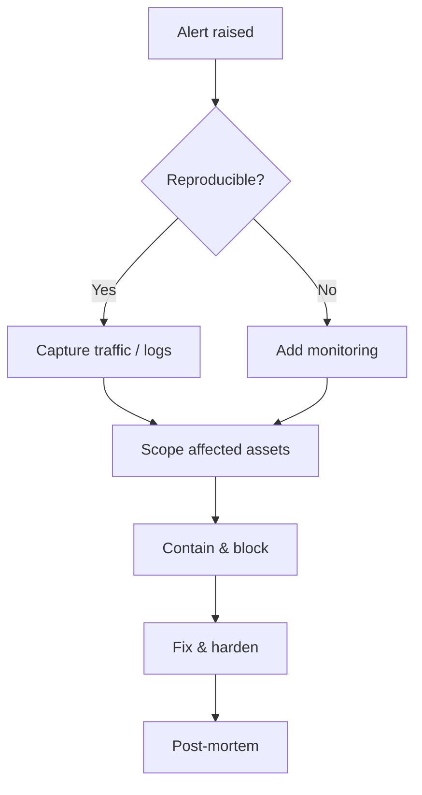
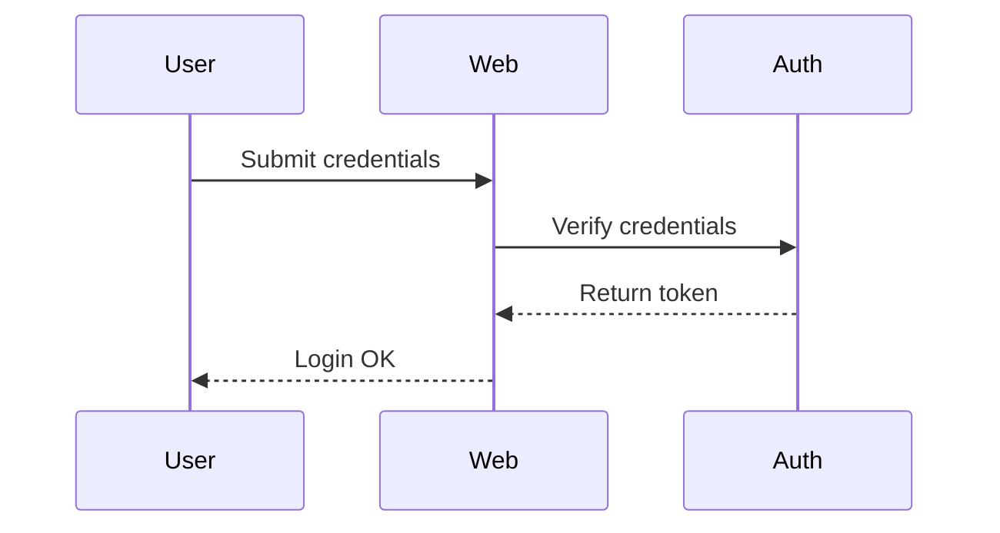

This page demonstrates three "technical content" capabilities: the **responsive image
gallery**, **Mermaid diagrams** and **KaTeX math**. All three share the same baseline:
**zero third-party requests by default, on-demand loading, and readable content without JavaScript**.

## 1. Responsive gallery

The `gallery` shortcode lays images out in a responsive grid. It **reuses the existing
image pipeline and lightbox**: page-bundle images automatically get multi-size WebP +
`srcset` + dimensions (CLS-safe), and images are **not wrapped in `<a>`**, so clicking any
of them opens the built-in lightbox — no need to rebuild it.


shot-a.png | Target recon | Screenshot from the recon phase
shot-b.jpg | Perimeter attempt | Web entry probing
diagram.svg | Attack path | Vector image kept as-is


### Three sources

Each row is `source | alt | caption` (the last two may be omitted). Sources support:

- **page-bundle resources** (relative filename, as above);
- **static paths** (starting with `/`);
- **external URLs** (`http(s)://`, checked against a scheme allowlist).

### Missing images fall back safely

A referenced image that does not exist renders as a **placeholder** carrying the alt text —
no broken image, no horizontal overflow:


shot-a.png | A normal image
not-exist-here.png | This one is missing | Should show a placeholder


## 2. Mermaid diagrams

Just use a ```mermaid fence. Mermaid is **loaded on demand**: the script is only injected
on pages that actually contain a fence. Sites that do not configure `params.mermaid` load
nothing at all (keeping "zero third-party requests by default"). This example site
**self-hosts** it (`static/js/vendor/mermaid.min.js`), so the page makes no CDN request.



Sequence diagrams too:



### Failure fallback

If the script fails to load or the syntax is wrong, the container gets `.mermaid-error`
and the **original code stays readable** — never a blank box.

## 3. KaTeX math

Inline math with `$...$`: Shannon entropy $H(X) = -\sum_{i=1}^{n} p_i \log_2 p_i$,
which measures the uncertainty of a key space in cryptography.

Block math with `$$...$$`:

$$
\text{AUC} = \int_{0}^{1} \text{TPR}(f)\, \mathrm{d}\,\text{FPR}(f)
$$

Bayesian update (used during incident response to revise hypothesis probabilities):

$$
P(A \mid B) = \frac{P(B \mid A)\, P(A)}{P(B)}
$$

KaTeX is also **loaded on demand**: the theme detects math delimiters at build time and
injects CSS / JS / auto-render only on pages that truly contain formulas.
Write the comment `<!-- nebula:no-math -->` in the body, or set `math: false` in
Front Matter, to skip rendering for **a single page**.

> Tip: the escaped `\$` in a price is recognised as a **currency symbol** and does **not**
> trigger formula rendering — the detector strips escaped dollar signs first.

## 4. Without JavaScript

All three degrade the same way:

- **Gallery**: pure CSS grid; images render regardless, only zooming is unavailable;
- **Mermaid**: raw code is shown in a `<pre>`; nothing is lost;
- **KaTeX**: delimiters and raw LaTeX stay readable.

That is what "progressive enhancement" means — **content first, interaction on top**.