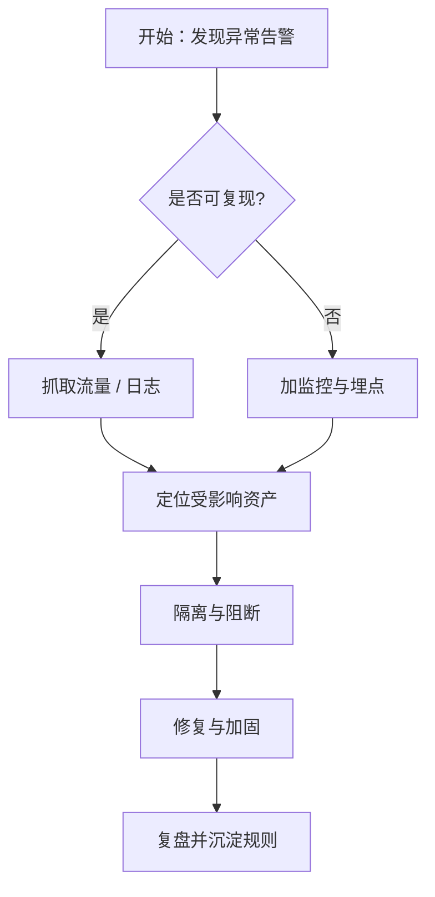
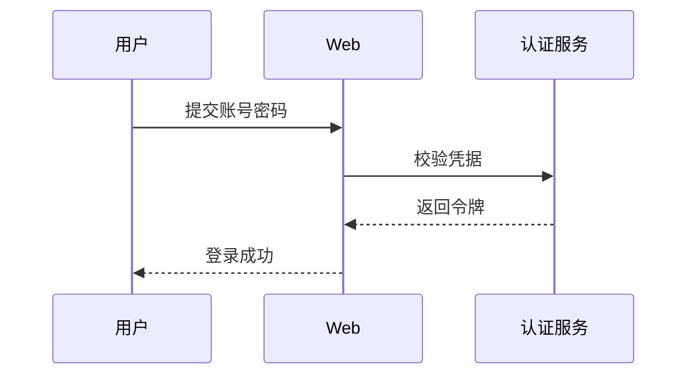

本页演示**功能三 / 功能四**中的三块"技术内容"能力：**响应式图片画廊**、
**Mermaid 图表**与 **KaTeX 数学公式**。三者共同的底线是：
**默认零第三方请求、按需加载、无 JavaScript 时正文仍可读**。

## 一、响应式图片画廊

`gallery` 短代码把一组图片排成响应式栅格。它**复用现有的图片 Pipeline 与灯箱**：
page bundle 图片自动获得多尺寸 WebP + `srcset` + 宽高（防 CLS），
图片**不被 `<a>` 包裹**，因此点任意一张都会进入主题内置灯箱——无需重复建设。


shot-a.png | 目标机信息收集 | 信息收集阶段的截图
shot-b.jpg | 边界突破尝试 | Web 入口探测
diagram.svg | 攻击路径示意 | 矢量图保持原图输出


### 三种来源

画廊每一行写 `源 | alt | 题注`（后两段可省略），来源支持：

- **page bundle 资源**（相对文件名，如上）；
- **static 目录路径**（以 `/` 开头）；
- **外链 URL**（`http(s)://`，scheme 白名单校验）。

### 缺图有回退

引用了不存在的图片时，画廊渲染为带 alt 文本的**占位块**，
既不会产生破损图，也不会横向溢出：


shot-a.png | 正常图片
not-exist-here.png | 这张图不存在 | 应显示占位块


## 二、Mermaid 图表

用 ```mermaid 围栏即可。Mermaid 由主题**按需加载**：只有本页出现围栏时才注入脚本；
未配置 `params.mermaid` 的站点则完全不加载（保持"默认零第三方请求"）。
示例站采用**自托管**（`static/js/vendor/mermaid.min.js`），因此页面没有任何 CDN 请求。



时序图同样支持：



### 失败也有兜底

若脚本加载失败或图语法有误，容器会加上 `.mermaid-error`，
**原始代码仍可读**（不空白、不崩版），不会让读者只看到一片空白。

## 三、KaTeX 数学公式

行内公式用 `$...$`：例如信息熵 $H(X) = -\sum_{i=1}^{n} p_i \log_2 p_i$，
其在密码学中衡量密钥空间的不确定性。

块级公式用 `$$...$$`：

$$
\text{AUC} = \int_{0}^{1} \text{TPR}(f)\, \mathrm{d}\,\text{FPR}(f)
$$

贝叶斯更新（应急响应中用于根据新证据修正假设概率）：

$$
P(A \mid B) = \frac{P(B \mid A)\, P(A)}{P(B)}
$$

KaTeX 同样**按需加载**：主题在构建期探测正文中的数学定界符，
只有确实含公式的页面才注入 CSS / JS / auto-render。
正文里写 `<!-- nebula:no-math -->` 注释，或 Front Matter 设 `math: false`，
即可让**单篇文章**跳过公式渲染。

> 提示：价格里的 `\$` 会被正确识别为**货币符号**而**不触发**公式渲染——
> 探测逻辑会先剔除转义美元符号。

## 四、无 JavaScript 时

三块能力的降级策略一致：

- **画廊**：纯 CSS grid，图片本身就渲染，无脚本时只是不能放大；
- **Mermaid**：原始代码以 `<pre>` 呈现，内容不丢失；
- **KaTeX**：定界符与原始 LaTeX 文本保持可读。

这正是"渐进增强"的含义——**先保证内容可读，再叠加交互**。